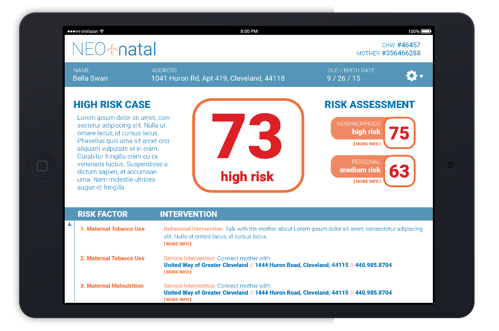

## Neo.Natal.Application
### Web application developed in Tri-C Coding Bootcamp

NeoNatal was devevloped as part of the capstone project for my coding bootcamp, and represented the first time I developed a large web application. I worked in a small team to design a web application that used public data to develop a profile for women who had recently given birth. Using the prototype from a medical hackathon project, NeoNatal was designed for healthcare workers to create, store, and retrieve unique infant mortality risk profiles for their clients, in the hopes of providing immediate care for those highest at risk:

>NEO-natal is a new approach to combating high infant mortality in many inner-cities. Recognizing that the best way to curb the problem is by focusing limited resources on the mothers with the highest probable chance of having a child die, the team developed a unique risk profile for mothers based on publically[sic] available demographic and geographic data correlated against clinical/medical research. With this new statistical tool, the team developed a short questionnaire that could be used by a community health worker to assess the risk level of a mother almost instantly.

 The original prototype can be found here: [Link to Hackathon website](https://www.prweb.com/releases/2015/10/prweb12995192.htm).

The application consists of three major parts: 

* The front-end, written in HTML, CSS, and JavaScript
* The back-end, using ASP.NET (I was the main developer for this piece) 
* The database, using Microsoft SQL Server (I developed the database. See SQL file)

My goal when developing the back-end of the application was to match the prototype as closely as possible. The front-end developer could then use the back-end code when developing the UI. Below are partial code snippets that serve to visualize my work when building this application. (clicking images will open new page).

###  Comparing the prototype and back-end development

###### The Client (prototype)

###### The Client (back-end)

###### The Survey (prototype)

###### The Survey (back-end. Note, the nullable ? in anticipation of NULL values in the database)

***
### The Database

A database was developed in MSSQL Server to create, store, and edit all Client, Survey, HealthcareWorker, and Login relevant information. Some fields are nullable with the expectation that some participants would not feel comfortable answering certain questions. (clicking image to see larger version).

***
### The Risk Score

Risk Score was calculated based on several factors, including demographic / demographic information of the client, as well as the client's personal habits. Each question in the survey was allocated a numerical value that could then be used to calculate a final score. This score could be stored in the database, and would be updated if any data changed. The prototype shows a high risk score, while the database entry (of a test client) shows a more moderate score. 

